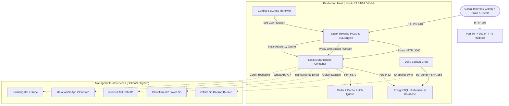

# E3 Rentals Qatar — Production Cloud Deployment Runbook

Comprehensive operational guide for deploying, configuring, scaling, and maintaining the E3 Rentals enterprise platform on cloud virtual machines (Ubuntu 22.04 / 24.04 LTS) using Docker Compose, Nginx, PostgreSQL 16, and Redis 7.

---

## 1. System Architecture



---

## 2. Recommended Infrastructure & Specifications

| Tier | Cloud Provider Recommendation | Specs (vCPU / RAM / SSD) | Target Workload |
| :--- | :--- | :--- | :--- |
| **Production Staging** | Hetzner CX22 / DigitalOcean Basic | 2 vCPU, 4 GB RAM, 40 GB NVMe | Up to 1,000 active bookings / month |
| **Enterprise Production** | AWS `t4g.xlarge` / GCP `e2-standard-4` | 4 vCPU, 16 GB RAM, 160 GB NVMe | 10,000+ active items, live GPS radar, multi-depot |
| **High Availability** | AWS RDS Postgres + ECS Fargate + ElastiCache | Multi-AZ Cluster | Mission-critical enterprise scale |

> [!NOTE]
> For standard standalone VPS hosting (Hetzner, DigitalOcean, Linode, AWS Lightsail), a 4GB RAM instance is ideal. Next.js standalone container runs in under 350MB of RAM during steady state.

---

## 3. Step-by-Step Initial Deployment

### Step 3.1: Server Bootstrap
SSH into your fresh Ubuntu 22.04 or 24.04 server as `root`:

```bash
ssh root@YOUR_SERVER_IP
```

Clone the repository to `/opt/e3-rentals`:

```bash
mkdir -p /opt/e3-rentals
cd /opt/e3-rentals
git clone https://github.com/malikamaan12/e3catalog.git .
```

Run the automated provisioning script to install Docker, configure the UFW firewall, enable Fail2ban, and allocate swap space:

```bash
chmod +x deploy/scripts/*.sh
./deploy/scripts/setup-server.sh
```

### Step 3.2: Configure DNS Records
Log into your DNS registrar (Cloudflare, Route53, Namecheap, etc.) and add the following records pointing to `YOUR_SERVER_IP`:

- **A Record**: `rentals.e3qatar.com` &rarr; `YOUR_SERVER_IP`
- **A Record**: `@` &rarr; `YOUR_SERVER_IP`

### Step 3.3: Issue Let's Encrypt SSL Certificate
Before starting Nginx with SSL, obtain the initial certificate using Certbot standalone mode:

```bash
# Temporarily allow port 80 challenge
apt-get install -y certbot
certbot certonly --standalone -d rentals.e3qatar.com --non-interactive --agree-tos -m admin@e3qatar.com

# Copy or verify certificates exist at:
# /etc/letsencrypt/live/rentals.e3qatar.com/fullchain.pem
# /etc/letsencrypt/live/rentals.e3qatar.com/privkey.pem
```

Populate the Docker certbot volume with the generated keys:
```bash
docker volume create e3_certbot_certs
docker run --rm -v e3_certbot_certs:/dest -v /etc/letsencrypt:/src alpine cp -a /src/. /dest/
```

### Step 3.4: Configure Production Secrets
Create your production `.env.production` from the provided example template:

```bash
cp .env.production.example .env.production
nano .env.production
```

Generate cryptographically secure 32-byte tokens:
```bash
openssl rand -base64 32
```
Paste the generated secrets into:
- `AUTHENTICATION_SECRET`
- `JWT_SECRET`
- `NEXTAUTH_SECRET`
- `POSTGRES_PASSWORD`
- `REDIS_PASSWORD`
- `CRON_SECRET`

### Step 3.5: Launch the Production Stack
Run the deployment script:

```bash
./deploy/scripts/deploy.sh
```

This will automatically:
1. Build the hardened Next.js standalone container.
2. Initialize PostgreSQL 16 and Redis 7 healthchecks.
3. Push database schema migrations (`npx drizzle-kit push`).
4. Start Nginx reverse proxy with SSL termination.
5. Verify `/api/health` responsiveness.

---

## 4. Seeding Initial Database & Superadmin

To seed initial categories, equipment inventory, flight cases, and admin credentials into the production database:

```bash
docker compose -f docker-compose.prod.yml run --rm app npm run seed
```

---

## 5. Continuous Deployment & Updates

For ongoing zero-downtime updates:

```bash
cd /opt/e3-rentals
./deploy/scripts/deploy.sh
```

The script fetches the latest master branch, rebuilds the container, performs schema migrations, executes a rolling replacement of the application container, and reloads Nginx gracefully with **0 seconds of user downtime**.

---

## 6. Automated Backups & Disaster Recovery

### Daily Backup Cron Job
Configure a daily cron job to back up the database at 03:00 AM AST:

```bash
crontab -e
```
Add the following line:
```cron
0 3 * * * /opt/e3-rentals/deploy/scripts/backup.sh >> /var/log/e3-backup.log 2>&1
```

### Manual Backup Snapshot
To trigger an immediate backup:
```bash
./deploy/scripts/backup.sh
```
Snapshots are saved to `deploy/backups/e3_rentals_backup_<TIMESTAMP>.sql.gz` along with a SHA-256 integrity checksum (`.sha256`).

### Database Restoration Runbook
To restore a snapshot in disaster recovery:
```bash
# 1. Unzip the snapshot
gunzip -c deploy/backups/e3_rentals_backup_20260905_030000Z.sql.gz > /tmp/restore.sql

# 2. Feed into PostgreSQL container
docker compose -f docker-compose.prod.yml exec -T postgres psql -U e3admin -d e3_rentals_prod < /tmp/restore.sql

# 3. Clean up temporary uncompressed SQL file
rm /tmp/restore.sql
```

---

## 7. Monitoring & Operational Inspection

### Inspect Real-Time Application Logs
```bash
docker compose -f docker-compose.prod.yml logs -f app
```

### Inspect Nginx Access & Rate Limiting Logs
```bash
docker compose -f docker-compose.prod.yml logs -f nginx
```

### Inspect Container Resource Usage (CPU / Memory)
```bash
docker stats
```

### Healthcheck Endpoints
- **Liveness probe**: `https://rentals.e3qatar.com/api/health` &rarr; Returns `{ status: "ok", version: "...", commitSha: "..." }`
- **Readiness probe**: `https://rentals.e3qatar.com/api/health/ready` &rarr; Checks PostgreSQL and Redis network connectivity.

---

## 8. Qatar Compliance & Security Matrix

- **Port Isolation**: PostgreSQL (`5432`) and Redis (`6379`) are bound strictly to `127.0.0.1` and container internal networks; WAN exposure is blocked at both Docker and UFW firewall levels.
- **Unprivileged Runtime**: Next.js runs inside Alpine Linux under unprivileged user `nextjs` (UID `1001`), completely disallowing root privilege escalation.
- **Rate Limiting**: Brute-force protection limits `/api/auth/` to 10 requests per minute and general API to 30 requests per second.
- **WebSocket Streaming**: `/api/driver/gps/stream` is tuned with 24-hour read timeouts and bypasses proxy buffering for instantaneous driver coordinate broadcasts.
- **Data Retention**: Local database snapshots are retained for 30 days and automatically pruned by `backup.sh`.
